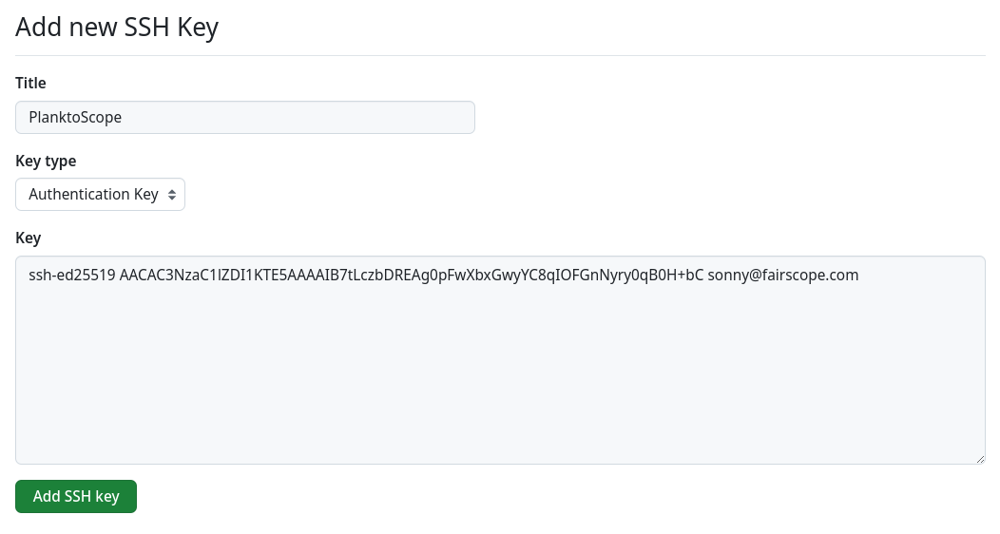
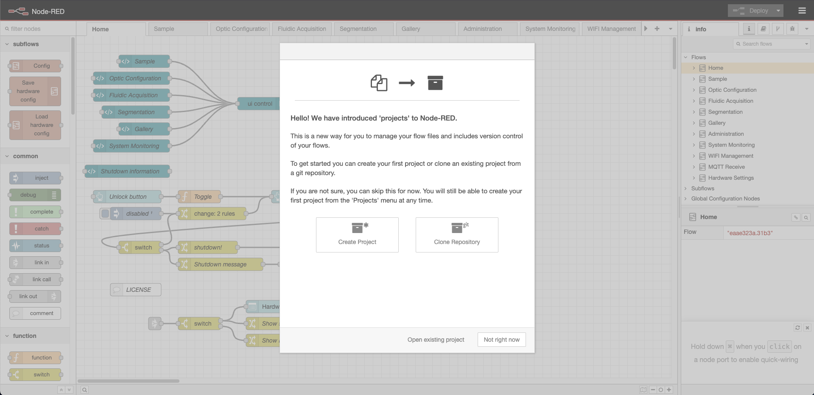
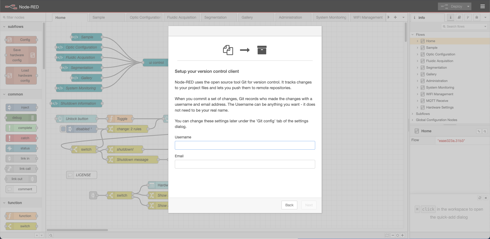
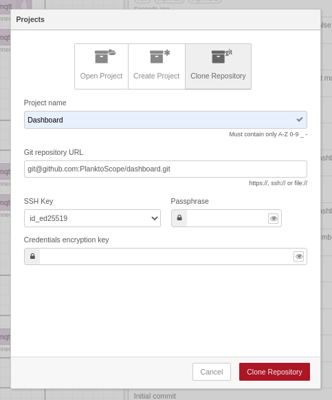

# **Dashboard Update for PlanktoScope**

## **Setting Up Your PlanktoScope**

1. **Prepare the SD Card**

   * Download the [latest PlanktoScope release](https://github.com/PlanktoScope/PlanktoScope/releases).

   * Flash the release to an SD card using [Raspberry Pi Imager](https://www.raspberrypi.com/software/).

     * Open Raspberry Pi Imager.
     * Select **"Choose OS"** and locate the PlanktoScope image.
     * Select **"Choose Storage"** and pick your SD card.
     * Click **"Write"** to flash the image.

   * Insert the SD card into the PlanktoScope.

2. **Connect to the Local Network**

   * Use an Ethernet cable to connect the PlanktoScope to your local router.
   * Power on the PlanktoScope.

3. **Connect the PlanktoScope to Wi-Fi**

   * Once the PlanktoScope’s Wi-Fi becomes visible, use your computer or mobile device to connect it to your local router’s Wi-Fi network.

***

## **Configuring Node-RED Settings**

To enable essential Node-RED features, edit the `settings.js` file.

1. **Access the File**

   * Use SSH or navigate via the **System File Manager** link on the Landing Page:\
     [http://planktoscope.local/admin/fs/files/etc/nodered/settings.js](http://planktoscope.local/admin/fs/files/etc/nodered/settings.js).

2. **Enable Context Storage**

   * This feature allows data to persist between Node-RED reboots.

   * Remove the comments between **line 265** and **line 269**:

     ```javascript
     contextStorage: {
         default: {
             module: "localfilesystem"
         },
     },
     ```

3. **Enable Project Mode**

   * This feature enables version control in Node-RED.

   * Set the `enabled` value to `true` on **line 338**:

     ```javascript
     projects: {
         /** To enable the Projects feature, set this value to true */
         enabled: true,
         workflow: {
             /** Set the default projects workflow mode.
              *  - manual - you must manually commit changes
              *  - auto - changes are automatically committed
              * This can be overridden per-user from the 'Git config'
              * section of 'User Settings' within the editor
              */
             mode: "manual"
         }
     },
     ```

   * Save the changes to `settings.js`.

4. **Add node-red-contrib-ecotaxa**

  * Go into the PlanktoScope terminal and type the following

     ```sh
    cd /home/pi/
    git clone -b node-red-ecotaxa https://github.com/PlanktoScope/PlanktoScope.git repo
    cd /home/pi/.node-red/nodes
    ln -s /home/pi/repo/software/node-red-dashboard/planktoscopehat/nodes/ecotaxa ecotaxa
     ```

5. **Save and Restart**

   * Restart the PlanktoScope using the **Reboot** button in the Node-RED dashboard:\
     [http://planktoscope.local/ps/node-red-v2/ui/#!/](http://planktoscope.local/ps/node-red-v2/ui/#!/).

***

With these steps, your PlanktoScope is fully configured and ready for use.

## Setup git on the RPI

### Create a key

To access the terminal of your PlanktoScope, you can use the Cockpit terminal [http://planktoscope.local/admin/cockpit/system/terminal](http://planktoscope.local/admin/cockpit/system/terminal). Log in with the following credentials:  
**Username:** `pi`  
**Password:** `copepode`


Enter the following command (replace the email with your GitHub email address)

```sh
ssh-keygen -t ed25519 -C "your_email@example.com"
```

When you're prompted to "Enter a file in which to save the key", you can press Enter to accept the default file location.

At the prompt, type a secure passphrase.

See also [Generating a new SSH key](https://docs.github.com/en/authentication/connecting-to-github-with-ssh/generating-a-new-ssh-key-and-adding-it-to-the-ssh-agent#generating-a-new-ssh-key)

### Add the key to GitHub

Copy the newly created SSH public key on the PlanktoScope to your clipboard.

```sh
cat ~/.ssh/id_ed25519.pub
```

If your SSH public key file has a different name than the example code, modify the filename to match your current setup. When copying your key, don't add any newlines or whitespace.

Go to [GitHub Add new SSH Key](https://github.com/settings/ssh/new)

In the "Key" field, paste your public key.



See also [Adding a new SSH key to your GitHub account](https://docs.github.com/en/authentication/connecting-to-github-with-ssh/adding-a-new-ssh-key-to-your-github-account#adding-a-new-ssh-key-to-your-account)

## **Add the project to Node-RED**

Access the dashboard editor at: [http://planktoscope.local/admin/ps/node-red-v2/](http://planktoscope.local/admin/ps/node-red-v2/).

Node-RED will display a pop-up inviting you to clone the dashboard repository.



Click on **Clone Repository**.



Enter your name and GitHub email address and press next.



Enter `git@github.com:PlanktoScope/dashboard.git` in "Git repository URL". Node-RED will automatically find your SSH Keys.

Enter the passphrase chosen in the [Setup git on the RPI](#setup-git-on-the-rpi) step.

Leave "Credentials encryption key" empty.

Press "Clone project".

### **Install Required Nodes**

After cleanup, install the following nodes:

* `@flowfuse/node-red-dashboard`
* `@flowfuse/node-red-dashboard-2-ui-flowviewer`
* `node-red-contrib-cron-plus`

***

## **Read and Write Data in global.json**

With Context Storage enabled, data can be stored in a file located at: [http://planktoscope.local/admin/fs/files/home/pi/.node-red/context/global/global.json](http://planktoscope.local/admin/fs/files/home/pi/.node-red/context/global/global.json).

### **Read Data**

To retrieve a value stored in this file, use the following script in a Function Node:

```javascript
// Retrieve the global variable
msg.variable = global.get('variable');
return msg;
```

### **Template Node to Display and Modify Data**

```html
<template>
    <v-text-field
        label="My variable"
        variant="outlined"
        v-model="msg.variable"
        @update:model-value="send({ variable: msg.variable })"
    ></v-text-field>
</template>
```

### **Write Data**

To set a value in the file, use the following script in a Function Node:

```javascript
// Set a value in the global context
global.set('variable', msg.variable);
return msg;
```

