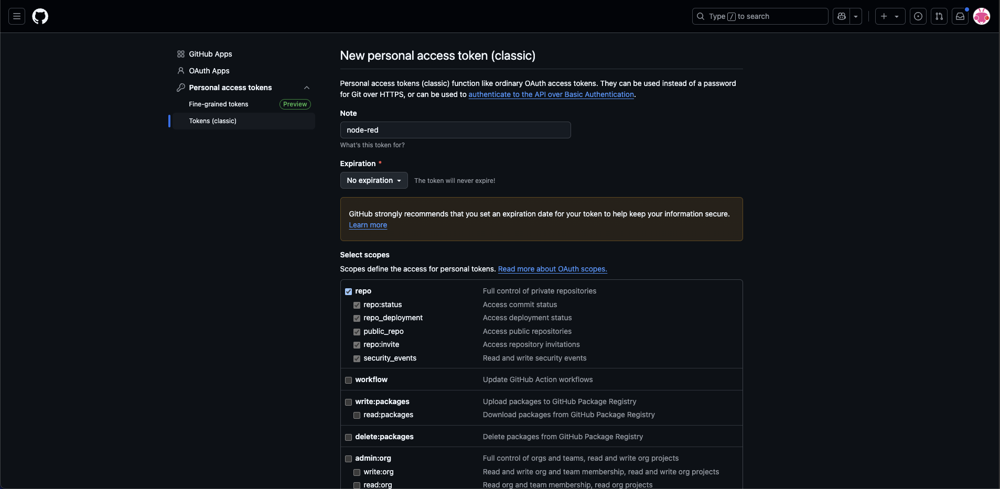

# **Dashboard Update for PlanktoScope**

## **Setting Up Your PlanktoScope**

1.  **Prepare the SD Card**
    
    -   Download the [latest PlanktoScope release](https://github.com/PlanktoScope/PlanktoScope/releases).
    -   Flash the release to an SD card using [Raspberry Pi Imager](https://www.raspberrypi.com/software/).
        -   Open Raspberry Pi Imager.
        -   Select **"Choose OS"** and locate the PlanktoScope image.
        -   Select **"Choose Storage"** and pick your SD card.
        -   Click **"Write"** to flash the image.
    -   Insert the SD card into the PlanktoScope.
2.  **Connect to the Local Network**
    
    -   Use an Ethernet cable to connect the PlanktoScope to your local router.
    -   Power on the PlanktoScope.
3.  **Connect the PlanktoScope to Wi-Fi**
    
    -   Once the PlanktoScope’s Wi-Fi becomes visible, use your computer or mobile device to connect it to your local router’s Wi-Fi network.

----------

## **Locating the IP Address of Your PlanktoScope**

1.  **Check Your Router’s Admin Panel**
    
    -   Open your router’s admin interface by entering one of these common addresses into your browser:
        -   `http://192.168.0.1`
        -   `http://192.168.1.1`
        -   `http://routerlogin.net`
    -   Log in using your router’s credentials (check your router label or manual for default credentials).
2.  **Locate Connected Devices**
    
    -   Navigate to the section listing connected devices, such as:
        -   "Connected Devices"
        -   "Device List"
        -   "DHCP Clients"
    -   Look for the device labeled **PlanktoScope** or a similar name under the **Ethernet** or **Wi-Fi** section.
3.  **Use Network Scanning Tools (Optional)**  
    If you can’t access your router:
    
    -   **Windows:** Use [Advanced IP Scanner](https://www.advanced-ip-scanner.com/).
    -   **macOS/Linux:** Run a network scan with `nmap` or similar tools:
        
        ```bash
        nmap -sn 192.168.1.0/24
        ```
        
    -   Look for the PlanktoScope in the results.
4.  **Verify the Landing Page**
    
    -   Open a browser and enter the PlanktoScope’s IP address (e.g., `http://192.168.x.x`) to access the **Landing Page**.

----------

## **Configuring Node-RED Settings**

To enable essential Node-RED features, edit the `settings.js` file.

1.  **Access the File**
    
    -   Use SSH or navigate via the **System File Manager** link on the Landing Page:  
        [http://192.168.x.x/admin/fs/files/etc/nodered/settings.js](http://%3Cyour-planktoscope-ip%3E/admin/fs/files/etc/nodered/settings.js).
2.  **Enable Context Storage**
    
    -   This feature allows data to persist between Node-RED reboots.
    -   Remove the comments between **line 265** and **line 269**:
        
        ```javascript
        contextStorage: {
            default: {
                module: "localfilesystem"
            },
        },
        ```
        
3.  **Enable Project Mode**
    
    -   This feature enables version control in Node-RED.
    -   Set the `enabled` value to `true` on **line 338**:
        
        ```javascript
        projects: {
            /** To enable the Projects feature, set this value to true */
            enabled: true,
            workflow: {
                /** Set the default projects workflow mode.
                 *  - manual - you must manually commit changes
                 *  - auto - changes are automatically committed
                 * This can be overridden per-user from the 'Git config'
                 * section of 'User Settings' within the editor
                 */
                mode: "manual"
            }
        },
        ```
        
4.  **Save and Restart**
    
    -   Save the changes to `settings.js`.
    -   Restart the PlanktoScope using the **Reboot** button in the Node-RED dashboard:  
        [http://192.168.x.x/ps/node-red-v2/ui/#!/8](http://%3Cyour-planktoscope-ip%3E/ps/node-red-v2/ui/#!/8).

----------

With these steps, your PlanktoScope is fully configured and ready for use.

## **Link Node-RED to GitHub**

After rebooting, reach the dashboard editor at : http://192.168.x.x/admin/ps/node-red-v2/ 

Node-red will suggest you a pop-up which invite you to select notably to clone the dashboard repository by clicking on **Clone Repository**.


Enter your GitHub credentials : 

In order to complete the new part of the form, you'll need first to create a Personal access tokens (classic) by getting to this page : [https://github.com/settings/tokens](https://github.com/settings/tokens) anbd by clicking on **Generate new token/Generate new token (classic)**. 

On this page, enter the name of the token, here **node-red** could be a good name, select **No Expiration** and check **repo** and **user** and then click at the bottom of the page on **Generate token**.



Copy the generated token from GitHub. Complete the remaining fields as prompted using your GitHub credentials, and click **Clone project** to link Node-RED to your GitHub account.


You should be good to go.


